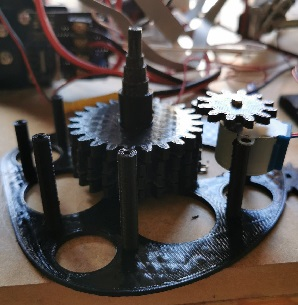
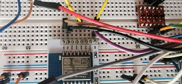

# Where'sLy Clock Project

#Updates:Improve the ability to reset the device, bad use of delays required button press for over 10-20 seconds.  Starting the process of handling insecure/securemqtt  as I personally switch to local mqtt.

## Who Am I ?
You can find me on twitter as @binaryjam, I'm Simon. If you came here from another website, using my photos and watermarking them as there own, well they had nothing to do with this build, this site, nothing.
Thanks for the link but your attribution sucks fella.   (Hence this intro).

## Intro
    

This project contains all the work I have done so far on creating a working GPS driven clock that emulates the Magical Clock from the Harry Potter films.  

I spent months on this and you are free to download the project, its on an MIT open source licence.  
If you have trouble drop an incident.
If you feel you could contribute to the project, let me know, I have no idea how to organise that, yet, but taking suggestions.  

## Careful now
  
> ***Warning:*** This is an experimental project using electronic components that may or may not be CE rated,
> and is not by any means production ready.  I take no responsibility for any
> problems, fires, explosions, poltergeists or curses.  If you are not qualified or experienced
> in making devices like this and can certify it as safe yourself, don't do it. Even then dont leave it plugged
> in unless you know for sure it going to be ok.  
>  
> I have to put this in, this is electricity and you are buying and sourcing and building this, not me.  Don't
> rely on the diagrams I provided, ***verify every wire, every connection***, it is very easy to connnect the wrong
> wires, believe me I have destroyed 2 Stepper motor drivers already.  

## Background
About four years ago, having watched a Harry Potter film. I knew; I could make that.  I knew, I could build some arduino program to do this, linked to an MQTT server and some kind of app to get location data.

What I also knew was,  I would have problems with CAD, designing a mechanism and God Damn 3D printing.  I had no skills or experience in the first two, but had had been working with my 3D printer for a while, and I HATE 3d printing, it's an absolute pain in the backside.

So it stayed in my head.

Recently this year, I'd like to say in lockdown, but I've been working the whole time; I came across other people who had also thought, I can make that, and they did.  Having seen others do this, it gave me a kick to finally get started.

It's from seeing how others designed and made their projects that made me think, "that's not how I was going to do it,  I like it, there are some brilliant ideas there, but definately not how I would do it".

One such project, that gave me the biggest kick, because it was done by one chap, not a university team or sqaud of engineers.  Just some guy, like me, I believe.  This project above all others was the one that drove me to do it my way,  except for, I totally stole his lad's design for clock hands (scissors) and used it as a base for mine (they are different mechanism) it was just right and didnt need changing.

This was one of the best sources of inspriation and you could actually build something better than where I currently am, and its so well documented Im giving it special mention here. Other projects that inspired will be in an appendix.
So take a look at his project, https://github.com/randomstring/WeasleyClock.  

## Ethos
So if this other project's so damn good why do this.   Well sheer bloody mindedness and a ethos that has ran thru most of my projects.  **Cost** (and a loathing of Python).

The aim of this project was to produce something that could be built cheaply*.

Requiring a 3D printer can be expensive, and whilst I had one to design and build this with, the aim was if you could beg, borrow steal or visit a HackerSpace (ideally a hackerspace) then you could print the mechanical components and not be reliant on what is can be expensive gears and cogs from a hobbyshop.  The cost to print the mechanism, is pennies, I havent worked it out I'll be honest, but even with electric bill it's still under a fiver (probably under a quid).

By using arduino and its clones and simple stepper motors, the cost of the electronics should
**come under £20**, if you wait for the month long shipping :-).

**By comparison, other projects, I estimated just for components, not mounting boards or wires is approx $450.**

You could by a cheap 3d Printer, and still come out with money to spare. Admittedly it doesnt have the precision and I would love to build with precision components with some changes to my electronics,
but thats a lot of money for a hobby project, that isnt being spent on tools.

## Operating Principles

Keeping with the miserly theme, the operation of this clock, relies on an OpenSource SmartPhone
app for Android or IOS called [Owntracks](https://owntracks.org/) to collect up to 4 different peoples
locations.

Next is the Cloud Server.  Owntracks is configured to talk to an MQTT server, you can run your own
if you are technically minded on a Raspi,  but I found a low cost (free sometimes) Cloud service, that 
I have used and is really reliable, called [HiveMQCloud](https://www.hivemq.com/downloads/) they offer a free cloud based service that can connect up to 100 devices, and we need 5, maybe 7 depending if you want to debug at the same time.

Lastly is the "clock" itself, this uses Arduino based programming on top of 3 micro processors, the main controller being a wifi enabled chip called an ESP 8266 version 12.  This listens to the MQTT server for messages broadcast by the Mobile devices, and matches those messages/events to a clock hand (person) and a position on the clock face.

## The Clock Face
This is based on the book design, in that it has 8 locations, two of which are lost and travelling.
The others are Home and Quidditch etc.  Well I dont play Quidditch and I want real people locations,
which means a custom design for the clock face.  For those that want a Potter realism then you could use
the design from Mina Lima, they sell their design, I have no idea of the size of this, because I do not use it
I also dont want it in this project for Copyright reasons, I mean we are sailing close the wind anyway,
so I started to create a version in this project, under the Images Folder, it's not finished, this is the first thing I realised that I can't do this all by myself, there are some things if I open this project up, it could be improved together.  

The New Design is built using GIMP an OpenSource image editor, this is so anyone can take this and build on it without needing photoshop etc.
Also the Image is Sized and split into Quarters, print each qtr on an A4 page, as the pixel/dpi/print size is set for an approx 13"x13" square.
DONT USE WINDOWS PRINT to print anything it will scale it and it wont fit.  **Print From GIMP**.

<table>
<tr><td><image src="markup/minadesign.png"></td><td><image src="markup/newclockdesign.png"></td></tr>
<tr><td><a href="https://minalima.com/product/the-weasley-family-clock/">Mina Lima Site</a></td><td>The begining of my version</td></tr>
</table>

## The Mechanism
 

Included in the Folder 3dPrinting are all the STL files I used to print my current working device,  I started with PLA but moved to PETG printed at 240C a bit stringy, but better layer bonding.

This was designed using Fusion360, a tool I had no experience in, my only CAD experience being 30 years ago at technical colleage doing pencil based engineering drawing.  So yeh I learned enough of this tool and enough about mechanics and guessed a lot of this design together, Im no engineer.

## Electronic Components
Once printed it was fitted with the cheapest stepper motors and driver boards I could buy, this decision
led to needing to use 3 microprocessors, as each motor needed 4 control wires, this is why others used RasPis
and servos, its an all in one solution, in a friendly language like python (spits).

The original device I created used slightly different components.  It always used 3 microprocessors, but of
different voltages, my upgrades and redesigns have managed to change this so that the microprocessors are all 3v
and the motors are 5v,  this makes the circuitry much easier and I have removed a Logic Level Converter
and I intend to remove the 12v power converter I use to a simple USB 2.1A charger instead (fingers crossed).

[5 Pack - Geared Stepper Motor 28BYJ-48 5V Stepper Motor + Uln2003 Motor Driver Board](https://www.amazon.co.uk/GeeekPi-Stepper-28BYJ-48-Uln2003-Compatible/dp/B087BYKB6T/ref=sr_1_3_sspa?dchild=1&keywords=Stepper+Motor&qid=1623273284&sr=8-3-spons&psc=1&spLa=ZW5jcnlwdGVkUXVhbGlmaWVyPUFSSUVPWDVIVTc2OVomZW5jcnlwdGVkSWQ9QTA1ODUzODEzVEJORkFaREVTVVhNJmVuY3J5cHRlZEFkSWQ9QTAxMzg4ODgzMjdIUFVUSExZMFJaJndpZGdldE5hbWU9c3BfYXRmJmFjdGlvbj1jbGlja1JlZGlyZWN0JmRvTm90TG9nQ2xpY2s9dHJ1ZQ==)
Thats 5 stepper motors for just over a tenner, and they are accurate enough (or will be when we improve the mechanism, there is some slight give).

[1 x ESP8266 v12](https://www.aliexpress.com/item/32651747570.html?spm=a2g0o.search0302.0.0.363f671606UZqc&algo_pvid=null&algo_expid=null&btsid=2100bdec16232747050722096e44de&ws_ab_test=searchweb0_0,searchweb201602_,searchweb201603_) £1.43

[2 x Arduino ATMEGA328P-MU 328P Mini ATMEGA328 3.3V 8MHz](https://www.aliexpress.com/item/32978427914.html?spm=a2g0o.productlist.0.0.1d956820FAKhBS&algo_pvid=896cfcf3-bb76-4968-87b1-5fdcbe064ed9&algo_expid=896cfcf3-bb76-4968-87b1-5fdcbe064ed9-0&btsid=0b0a050116232750314502349ec27b&ws_ab_test=searchweb0_0,searchweb201602_,searchweb201603_)   These were £0.86 but now are just under £2 each. 

[3v ARCELI 5 Pack 3 Pins AMS1117-3.3 DC 4.75V-12V to 3.3V Voltage Regulator Step Down Power Supply Buck Module 800mA](https://www.amazon.co.uk/gp/product/B07MY2NMQ6/ref=ppx_yo_dt_b_asin_title_o02_s00?ie=UTF8&psc=1)
You only need 1 of these, but I bought a bunch of them.  £5.99 
*Now I havent properly rated this circuit, I'm not electrician, again help here in locating the best safest parts whilst keeping costs low would help here. Raise an Issue if you have ideas.*

[USB Micro-B Breakout Board](https://thepihut.com/products/adafruit-usb-micro-b-breakout-board?variant=27739636049&currency=GBP&utm_medium=product_sync&utm_source=google&utm_content=sag_organic&utm_campaign=sag_organic&gclid=CjwKCAjw2ZaGBhBoEiwA8pfP_jraw2qhUHO6fedGwqFAW4pzVt3YWjVqfcwhewlCwfkpNak2yOJ8CBoCrogQAvD_BwE)  
I have an surface mount version of this I got from Ebay (seeler gone now) really chep, this is going to be easier to solder on though
but its too expensive with shipping but if you want easy this is the one.  £5.00 (ish)  

[PCB Prototyping Boards](https://www.amazon.co.uk/gp/product/B08ML5187X/ref=ppx_yo_dt_b_asin_title_o09_s00?ie=UTF8&psc=1)
I bought a bunch of these because I will use them, but you can get one off.

Wire. You will need Wire, and Solder and Flux and soldering Iron, and a pair of funky magnifying glasses if you're geting older. 

**Parts that you might want, if you are using 5v Arduinos, but I dropped this designs for this in the project files.**

[Logic Level Converter Bi-Directional](https://www.amazon.co.uk/gp/product/B00M7U5DV2/ref=ppx_yo_dt_b_asin_image_o03_s00?ie=UTF8&psc=1)
This is used for the communication between the 3v ESP chip and the 5v arduinos, if you choose this route (don't).  Because you cant fire 5v into the ESP.   The ESP talks to the arduinos using I2C protocol.

[Step Down voltage converter](https://www.ebay.co.uk/itm/254234341174?_trkparms=ispr%3D1&hash=item3b318c2f36:g:bHcAAOSwJ9FfqaEy&amdata=enc%3AAQAFAAACgBaobrjLl8XobRIiIML1V4Imu%252Fn%252BzU5L90Z278x5ickkrDx%252B2NLp21dg6hHbHAkGMXw9ccVnFRBVt0OQjL7AnSLPyZZRhKHnQWBFAKvUIMCQCOl2oFAEjoVtlR1bNqfL159PkIHvppHyBxB%252FHUwOBQSXIHDTPCbL4FvyMDWbtqXphqvB0tlBr7pm3D0c0wwnB%252Fpp8F8AtWUesC7a1t45nlFa6KT5y1wgg8qJ011lGX7ULvobh5CJRWxzt1CLGeo0D52cKOTFfq1ZFtZE7bfhjKQE8JB173Vp9lBkB6CXIBg29X7KDZVizISB%252FZpb%252FdvKOi%252FhYIvFFiFvdKlmaDYvYYq3o5Yzo2tQO1MXKOG7d%252BoGrhacjIEugSZr%252BKoX6YVrbNNJOH%252FZZheaVLS1ffHosDyldP96bcuktP0TjNRXdCLARo66W35twKH3fkIMVzQDNt9FWszUpZMImassfaeFfUtNb4YYlDdFVo5994qpOOth1e5QcCfvDZzmnJtCfo%252BANeVvtGUl8D5WMqb%252BMgKZHoVk6y9QL03LssGhUHTBPyjGaUZCYNKmFWIQM26jvmyBC8E7Mh2kQuoigFBoRLQdCgKrJjUk%252BOBjRG%252BByqb9sd2WCETQK7eHGQvOt0%252B9Hpt4sC%252FRLK6wIKcY1C%252FN6WU7tS%252FNatw3flEUOr%252FmOSag%252FdbJq%252FyPGjsDe1ii9PB4rCgFgBgBKat8XkmmAYuXt74TKJzL6%252BpS2N4wLKbDH%252FuSJ6JlrqBMo8ydbcVIqtZwykYLdbSVURTKsrkHpZKW1PRAVvgwx57Niyn1AJw9zqw2R%252FtbTV5DZeJ4W%252BxlMsok93CnKmyarL9RbD5cxhwEZvF3%252F80%253D%7Ccksum%3A2542343411749f9c36282ec242c2968ba9ba37531dba%7Campid%3APL_CLK%7Cclp%3A2334524)
I am currently using one of these to go from 12v to 5v, I want to switch to USB charger instead

### Fritzing
I have tried to create a Fritzing diagram, and it's early stages , its not 100% correct, the parts it uses
are not 100% the same as listed here, the usb connector Im guessing at the pinouts, dont rely on it.  But it give you an idea about how this is connected together,  like I say you better understand electronics to build this and interpret what I have done and tried to describe here, don't take it as literal, and any experts out there please help.

These designs have ***NOT BEEN TESTED***, but they are close to what I have, instead of a USB sockeet I have a 12v step down voltage regulater as desribed above.
I am not experienced with Fritzing so am still learning, at this time, these diagrams are to give you an IDEA of what the circuit is, you should verify and validate every connection and wire yourself right now.

Draft Breadboard Design, The circuit here shows the connections for the voltage regulator in the circuit diagram,   the one I use and list in the components, has a different pin out, so this circuit would be wired differently.  You need to check everything, as manufacturers change pinouts all the time so trust nothing.

# Loading Software
Once you have built the circuit, you will need to load the software onto the Microcontrollers.  
In order to build this you will need experience of Arduino and Arduino software and installing
to different types of hardware.

First we are going to install the MainClock.ino onto the ESP8266 chip.  
*You will need to add boards specifically to the Arduino software for ESP*  

Here is a guide I used to help make this work.
http://technicalstuffhopefullyuseful.blogspot.com/2016/11/programming-standalone-esp-8266-12.html  
  
So following all the usual guides for installing code on an ESP,  load the MainClock.ino sketch
and upload this to the ESP8266.  
  
Next we need to load the StepperController to the Arduino Pro Minis, however at this point in time
the code needs to be altered for each unit.

Load the StepperController.ino Sketch for the first Arduino, check the code line for  

    const int whichModule = 1; //1 or 2

Upload this to the unit.

Next we need to change that Line of Code for the Second Arduino

    const int whichModule = 2; //1 or 2

Now upload this version to the second Arduino.

This is because the Main Clock communicates with both Arduinos using the I2C protocol and will talk to 1 or 2,  so the units need to know if they are 1 or 2.  Unit one handles clock hands 1 and 2 and Unit two handles clock hands 3 and 4.

*One of the many improvements I want to do is to have jumpers on the arduinos,  so depending on which pin is configured it would choose what device it was for I2C, so no editing of the code is needed.*

Put all these controllers into place ready to start the hardware up.  On first boot up there will be a configuration screen.  

# Configuration
## HiveMQ
The MQTT Server is the backbone of this system. Both sides of this project will connect to it, so it needs to be configured first.

Visit https://www.hivemq.com/mqtt-cloud-broker/ and Sign up.  Done that Cool, login in and you should see the console.

First Create a Cluster,  I picked AWS, despite being an Azure guy normally. 

Once created manage the Cluster, we are going to add some users.

Add two Users one called OwnTracks and one called clock pick your own passwords, remember the names and passwords.  

That's it.  It's as simple as that. 

**If you prefer to use your own MQTT server, because you are using HomeAssistant perhaps, go for it**

## OwnTracks.
### Phones per person config
There are four hands on this clock, only four because the mechanism is so big, if I could design a smaller
mechanism you could have more hands, but we got four.

So this means we need to configure OwnTracks on 4 separate phones.  If you only have 2 people or 1 in your fam
then obviously you only need 1 phone, and you can rip off the extra hands :-)

For the First Person, we would configure OT as follows.

<table>
<tr>
    <td width="20%">Open the preferences, hit Connection then Mode</td>
    <td width="20%">Select MQTT and Accept</td>
    <td width="20%">Select Host and fill in the HiveMQ details from earlier, give the device name I picked "SimonsPhone", cos guess what</td>
    <td width="20%">Select Identification, enter the HiveMQ user and password, then 1 and your Initials</td>
    <td width="20%">Select Security and ensure TLS is on</td>
</tr>
<tr>
  <td></td>
  <td></td>
  <td></td>
  <td></td>
  <td></td>
</tr>
</table>

The settting that defines the user to the clock is in the Identification section.  That Device ID of 1
refers to the 1st person.  The initials are shown on the OwnTracks map, as will your other fam members with their initials.   Of course if you want to go native,  pick RW for Ron, or GW for Ginny or George.

So to configure the next person follow the above procedure but change the Device ID to 2 and 3 then 4.
(Like I say you dont need 4 devices, just stop when your done and take off hands from the clock).

Lastly when in OwnTracks, there is a Play button on the map, click it until the setting says **Significant Changes only**, because we only care about when you move in or out of an Area.

### Area config
The next part is how we map each persons special location to a position on the clock.  We do this by
configuring Areas on each persons device.   We do this seperately, which is a bit of a pain, I know, 
but you could have 3 kids at 3 different schools perhaps, so we configure them seperate.

Each Area is a position on the clock, we have 6 configurable places on the clock, there are 2 fixed
positions, Lost and Travelling.

>1=Home  
>2=Mortal Peril  
>3=Quidditch  
>4=Work  
>5=School  
>6=Garden  

Imagine we are the Prime Minister and live at 10 Downing Street.  We need to know the GPS coordinates
for that.  We can get that from google maps.  Find the house click it in maps, the URL will change 
and include the GPS co-ordinates as shown here.  So for Downing Street its 51.5034044, -0.1298176  
As you dont live at No. 10 use your own GPS coords.  

To configure this, in the OwnTracks menu select Regions.
Then Add a new Region like this,  
The Description is the Location Number so in this case 1 for Home  
set the GPS co-ordinates for your house  
Set a radius of 10 metres, thats usually enough.    

For every location on the clock add a region at that location using the Numbers for the description.

Remember you repeat this for each person. 
  
## Configure the Clock
At this point the clock should be assembled, the arduinos and esp software loaded, there is no smoke or fires,
the clockwork is all assembled and motors in tight.

Turn on the clock.  When the clock boots up for the very first time, it has no configuration.
It detects this and will put the clock into Wifi Hub mode,  it will broadcast an SSID called
"Wheresley Clock".    Enter the Password "RubberDuck" to connect.

With a laptop or phone, connect to the Wifi of WhereslyClock.  Once Connected you will be prompted to signin,
Clicking that signin will show a webpage.

Fill in all the details for the MQTT server details the host, port, user and password, these were 
all configured in the HiveMQ console settings, if you are not sure go back and check it, perhaps create
a new user if you forgot the password.

When you save the unit will boot into Clock, mode and you can connect back to your normal Wifi net work.

The Clock is now running.

### Calibrate the clock.
The way I calibrate the clock right now, is turn it off, physically move all the hands on the clock to midnight, I hope you never glued the hands to the spindles, they should be tight enough to stay put, but movable so that you can spin them to the right place on the clock if needed.

I then send signals using the test software, to all the hands to go home, and give it a final tweak because the 3d mechanism isnt perfect yet.  You can do more tests sending it from home to lost for each person just tweaking it till you are happy.

## Testing it the easy way
So you will need to test this clock and rather than driving all over the place, you can just replicate some of the messages that would be sent by OwnTracks, using Apps on your phone.   I was using an App called
[MQTT DashBoard](https://play.google.com/store/apps/details?id=com.lapetov.mqtt&hl=en_GB&gl=US) on Android.

<table><tr><td></td><td></td></tr></table>

You can create you own version of this,  it's a little laborious, but has proved invaluable.
Start by creating a dashboard, register the MQTT server and user/pass details.  

On that dashbaord you are going to create buttons.Configure it for the connection you created earlier,
Then subscribe to Topic.   CASE SENSITIVE.

    ownTracks/OwnTracks/1/event

Set the Topic for Publish as the same

    ownTracks/OwnTracks/1/event

The digit /1/  refers to the person, rememeber we configured 4 people numbered 1 to 4, this is how the message will appear in the messages.

Then in the Button config open the design section.  We need to set the payload value to an example value

    {"_type":"transition","desc":"1","event":"enter"}

The Type mirrors an event in OwnTracks which is to Enter or Leave a Region.  The "desc" value refers to the Region/Area, see the table above for Area Config in OwnTracks. We only care about "Enter" events for most things, however for the Travelling setting we  can set the "desc" to anything, **but change the event type to "leave"**.

Lastly to configure the lost button the event is "enter" and the "desc" is "lost".

Repeat adding buttons one for each location and the two special locations.

To add other people Copy and paste all the buttons,  but you need to change the Topic for publishing
and change the /1/  to /2/ or /3/ and /4/  for each person.  

In this demo video, you can see me using the app to do this testing about half way through.

<a href="https://youtu.be/s3MRNlUg-BU">Click for the demo video</a>

## Build a box / Print the Face / Stick it together 
Ok so if you got this far you can build a box for this, I will add some more pictures of mine later.
I used some hardboard for theface drilled a hole in the middle, stuck the clock face picture to the face.

I built a frame out of some MDF strips, routered a slot for the hardboard to fit in and screwed it together.

I glued the top of the 3d print to the HB,  and glued the mechnism to the top.

I then got my glue gun and stuck the circuitry , stepper drivers to the hardboard as well.

That was it,  its simple, but after months of this, I've hit a wall and needed it done.  Later
with some advice and hopefully help from interested folk I can have a V2, improvements to the mechanism,
better choice of components, perhaps I can even order proper circuit boards.  I considered splitting the
circuit boards in two with an ic2/power connector between, not sure yet.

## Running it
I am no electrician and at this stage of the project am a little scared to leave it running 
unless you are an electrician I advise you to do the same, dont leave it unattended unless you know you built it with reliable safe components and you are confident it would pass safety tests.
Again I take no responsibility for what you do or what happens if you build this.  

## Pictures from the Build
These are some of the vids pictures from the build.

This shows me working on the electronics at quite an established stage of coding, I did a lot of
this work sat in a chair, proving it's possible to do things without a workshop, but it would have
been much easier with one.

<a href="https://www.youtube.com/watch?v=Jwz-Kaer89c">Click to Watch Early Build Video</a>

## Apendices
### Resources referred to during build
Arduino Nano | 3D CAD Model Library | GrabCAD
https://grabcad.com/library/arduino-nano--1

ULN2003 Unipolar Stepper Driver Board | 3D CAD Model Library | GrabCAD
https://grabcad.com/library/uln2003-unipolar-stepper-driver-board-1

simultaneous stepper motor control using accelstepper - Using Arduino / Motors, Mechanics, Power and CNC - Arduino Forum
https://forum.arduino.cc/t/simultaneous-stepper-motor-control-using-accelstepper/625179/14

Running both 5v and 3.3v devices on I2C | RobotShop Community
https://www.robotshop.com/community/blog/show/running-both-5v-and-3-3v-devices-on-i2c

Master Writer/Slave Receiver | Arduino
https://www.arduino.cc/en/Tutorial/LibraryExamples/MasterWriter

HTTPS requests to any URL using the ESP8266 - Maakbaas
https://maakbaas.com/esp8266-iot-framework/logs/https-requests/

tzapu/WiFiManager: ESP8266 WiFi Connection manager with web captive portal
https://github.com/tzapu/WiFiManager

hometinker12/ESP8266MQTTSSL: Example using the pubsubclient with WiFiClientSecure
https://github.com/hometinker12/ESP8266MQTTSSL

WifiClientSecure, PubSubClient and WifiManager dont work together · Issue #698 · tzapu/WiFiManager
https://github.com/tzapu/WiFiManager/issues/698

Arduino PubSubClient - MQTT Client Library Encyclopedia
https://www.hivemq.com/blog/mqtt-client-library-encyclopedia-arduino-pubsubclient/

HiveMQ Cloud
https://console.hivemq.cloud/

HiveMQ Cloud - Free Fully Managed MQTT Platform
https://www.hivemq.com/mqtt-cloud-broker/

The Movement - The Magic Clock
http://www.themagicclock.com/build-log/movintroduction-to-arduino-pro-mini-2.png (874×522)
https://www.theengineeringprojects.com/wp-content/uploads/2018/06/introduction-to-arduino-pro-mini-2.png

technical stuff, hopefully useful to some: Programming a standalone ESP 8266-12 using Arduino IDE and a FT232RL FTDI USB to TTL Serial Adapter
http://technicalstuffhopefullyuseful.blogspot.com/2016/11/programming-standalone-esp-8266-12.html

ement

Weasley Clock - printablepropss Webseite!
https://printableprops.jimdofree.com/en/harry-potter/weasley-clock/

K&S Brass Telescopic Tubing Assortments
£14.99 - 5/5 stars
https://www.etsy.com/uk/listing/735240006/ks-brass-telescopic-tubing-assortments?gpla=1&gao=1&&utm_source=google&utm_medium=cpc&utm_campaign=shopping_uk_en_gb_a-craft_supplies_and_tools-other&utm_custom1=_k_CjwKCAjwx6WDBhBQEiwA_dP8rVwSckBTIwWJQDCbRv1O2SVBy3879ruQ-wC7PSgB43yQHI1XIfMyYxoCSFoQAvD_BwE_k_&utm_content=go_325938528_20231667888_88477464288_pla-106551294035_c__735240006engb_142096120&utm_custom2=325938528&gclid=CjwKCAjwx6WDBhBQEiwA_dP8rVwSckBTIwWJQDCbRv1O2SVBy3879ruQ-wC7PSgB43yQHI1XIfMyYxoCSFoQAvD_BwE

HS Walsh | Jewellery Making Supplies, Clock & Watchmakers Tools
https://www.hswalsh.com/

What it does - OwnTracks Booklet
https://owntracks.org/booklet/guide/whathow/

randomstring/WeasleyClock: Project to build my own working Weasley Clock to track the location of family members.
https://github.com/randomstring/WeasleyClock

Arduino/BearSSL_CertStore.ino at master · esp8266/Arduino
https://github.com/esp8266/Arduino/blob/master/libraries/ESP8266WiFi/examples/BearSSL_CertStore/BearSSL_CertStore.ino

MQTT Connection with BearSSL and TLS 1.2 results in exception 28 · Issue #6232 · esp8266/Arduino
https://github.com/esp8266/Arduino/issues/6232

nickgammon/I2C_Anything: Arduino library to simplify reading/writing to I2C
https://github.com/nickgammon/I2C_Anything

C++ Shell
http://cpp.sh/

introduction-to-arduino-pro-mini-2.png (874×522)
https://www.theengineeringprojects.com/wp-content/uploads/2018/06/introduction-to-arduino-pro-mini-2.png

technical stuff, hopefully useful to some: Programming a standalone ESP 8266-12 using Arduino IDE and a FT232RL FTDI USB to TTL Serial Adapter
http://technicalstuffhopefullyuseful.blogspot.com/2016/11/programming-standalone-esp-8266-12.html

